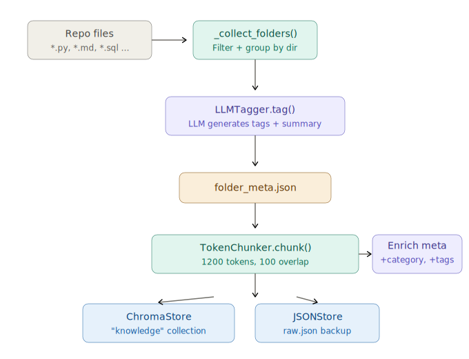

# `main` branch — 架構說明

這個 repo 是 **agent** 專案，放 `agent/` package：LangGraph agent、tool adapters、chat / eval CLI。`rag`（建索引、儲存、檢索、public retrieval API）是獨立 repo，在 `../rag`（github.com:Minervamuses/rag），透過 Poetry path dep 引入。

系統分成兩條獨立 pipeline：**Ingest**（rag 負責建索引）和 **Chat**（agent 驅動對話），唯一的交會點是磁碟上的 store。

---

## Pipeline 1：Ingest（建索引）



這條 pipeline 只跑一次（或資料更新時重跑），把 repo 裡的檔案變成可搜尋的 chunks。流程四步：

1. `_collect_folders()` 掃描 repo，按 `TEXT_EXTENSIONS` 過濾、按 `SKIP_DIRS` 排除，把檔案按**所在目錄**分組。

2. `LLMTagger.tag()` 對每個目錄呼叫一次 LLM，輸入是目錄路徑 + 檔名 + 檔案預覽，輸出是 2–4 個 tags 和一段 summary，存進 `folder_meta.json`。

3. `TokenChunker` 把每個檔案切成 1200 token 的 chunk。切完之後，每個 chunk 的 metadata 會從 `folder_meta.json` 繼承 `category`（第一個 tag）和 `tags`。

4. 所有 chunk 寫入 ChromaDB collection，同時備份到 `raw.json`。

磁碟上三個檔案：`chroma.sqlite3`（向量索引）、`raw.json`（全文備份）、`folder_meta.json`（目錄摘要）。

---

## Pipeline 2：Chat（Agent 查詢）



`agent/graph.py` 只有兩個 node 跟一條 conditional edge，LangGraph 自動處理循環：

**Agent node**：把目前所有 messages（system prompt + 對話歷史 + tool 結果）丟給 LLM，回傳「純文字」或「tool call 請求」。

**tools_condition**：LangGraph 內建 router。有 tool calls → 走 ToolNode；沒有 → 結束，回傳文字。

**ToolNode**：收到 tool call，dispatch 到對應的 tool，結果塞回 messages，自動回到 Agent node，形成循環。tool 拋例外時會被包成一行 `Tool error: ...` 丟回 agent，**不會炸掉整輪對話**。

### 四個工具家族

Agent 啟動時會把下列所有 tool 綁到 LLM；LLM 依照 system prompt 裡的「tool selection policy」自行決定該用哪一個。

**① 本地知識庫（永遠可用）**

本地 KB tool 由 `rag.TOOL_SCHEMAS` + `rag.dispatch(...)` 生成 LangChain tools；chat graph 不再維護一份獨立的 RAG tool schema。一般 chat 預設只綁互動檢索需要的三個 tool，`rag_list_chunks` 保留給 eval / audit 類內部流程，避免模型誤把整個 `raw.json` 掃進 prompt。

| Tool | 讀什麼 | 用途 |
|------|--------|------|
| `rag_explore` | `folder_meta.json` | 列出 categories、tags、date 範圍、每個目錄的 summary。agent 用來了解「知識庫裡有什麼」 |
| `rag_search` | ChromaDB 向量索引 | 語義搜尋，支援 `folder_prefix` / `category` / `file_type` / `date_from` / `date_to` filter。每筆結果帶 `pid` 和 `chunk_id` |
| `rag_get_context` | `raw.json` | 用 `pid` 找到同一檔案的所有 chunks，回傳目標 chunk 前後 N 個。看更多前後文用 |
| `rag_list_chunks` | `raw.json` | 不做 embedding，直接列舉 chunks；預設不綁進 chat，只給 eval / audit 使用 |

**② 對話歷史（永遠可用）**

| Tool | 讀什麼 | 用途 |
|------|--------|------|
| `recall_history` | `<rag persist_dir>/chat_history/` ChromaDB | 語義搜尋已經被擠出 context window、且成功持久化的舊對話內容；可選 `role` filter（`user` / `assistant`）。每筆結果帶 `role`、`turn_id`、`timestamp` |

已 eviction 的舊對話跨 process 持久化 — 關掉 CLI、重新啟動後，agent 仍可搜到已寫入 `chat_history` 的部分。最近 `agent_recent_turns_window` 輪仍是目前 session 的 prompt memory，不會在每輪即時寫入 Chroma。**不是 rag_search 的替代品**：問題如果是關於知識庫文件，依然走 rag_search。

**③ Web Search MCP（由環境變數開關；目前啟用）**

透過 `mrkrsl/web-search-mcp` 子進程，背後跑 Playwright 開 Chromium/Firefox 做搜尋。三個 tool：

| Tool | 用途 |
|------|------|
| `full-web-search` | 搜尋 + 抓每個 hit 的全文，吃 token 最多 |
| `get-web-search-summaries` | 只回傳搜尋 snippets，不抓全文，便宜很多 |
| `get-single-web-page-content` | 把一個 URL 的內文抽出來 |

適用場景：問到知識庫沒有的外部資訊（時事、別人家的論文/專案、通用技術文件）。

**④ GitHub MCP（由環境變數開關；預設關閉）**

透過 `github/github-mcp-server` 子進程，用 PAT 讀遠端 GitHub 狀態。啟用時 agent 會多出 repos / pull_requests / issues / actions / context 等工具。**不是 git 本地操作的替代品** — clone / pull / commit 還是在終端做，不要丟給 agent。

### Tool selection policy（寫在 system prompt）

- 問題是關於這個專案本身或研究筆記 → 用本地 KB（rag_explore / rag_search / rag_get_context）
- 問題提到本 session 之前講過的事，但已不在 prompt 裡 → 用 `recall_history`
- 問題需要當下的外部資訊 → 用 Web Search MCP
- 問題是遠端 GitHub 狀態（PR、issue、CI） → 用 GitHub MCP
- 某個家族沒綁上來（環境變數關掉）→ 當它不存在，用手上有的

### 長期記憶（vector-DB chat history）

對話歷史不是無限塞進 prompt，但也不再走 LLM 壓縮。`agent/memory.py` 是兩層結構：

1. **固定 system prompt**
2. **recent turns**（最近 `config.agent_recent_turns_window` 輪，預設 10，原始 user/assistant 訊息）

每完成一輪後 `ChatSession._evict_overflow` 檢查 `recent_turns`：超過 window 就把最舊那輪交給 `agent/history_rag/` 的 `ChatHistoryStore`，把 user prompt 跟 assistant response 各自 embed 成一個 chunk 寫入 `<rag persist_dir>/chat_history/`（單一 collection，metadata 帶 `role` / `turn_id` / `session_id` / `timestamp`）。寫入後才從 `recent_turns` 移除；成功寫入前，prompt pruning 不會把這些尚未持久化的 turn 丟掉。

**沒有 LLM 壓縮成本**：embedding 用本地 Ollama bge-m3，只在 turn 結束時跑一次 `add_documents`，沒有 OpenRouter 呼叫。**內容不失真**：原文逐字保留在 ChromaDB，需要時透過 `recall_history` 取回，agent 看到的是當時實際說過的話。**已 eviction 的歷史跨 session 累積**：同一個 persist dir 永遠只有一個 collection，所有已持久化的舊對話都在裡面；目前 session 的最近 window 輪仍留在 RAM。

存進去之後，agent 在後續對話裡靠 `recall_history` 自行決定要不要找回來。Tool 的呼叫純粹由 LLM 判斷，沒有任何 hard rule。

**失敗處理（明示，不再 silent fail）**：
- `add_turn` 拋例外（Ollama 掛、Chroma 卡 lock）→ `logger.warning` 一行，這輪保留在 `recent_turns`，下一輪再試。
- 若連續失敗導致 `recent_turns` 超過 `window * 3` → `logger.error`，把最舊那輪丟棄不存（防止 prompt 無限膨脹）。

不再使用：`agent_turns_per_compaction` / `agent_compaction_model` / `agent_compaction_max_tokens`、rolling summary、`compact_turns()`，全數移除。

### Session lifecycle（async）

MCP tools 是純 async 的 `StructuredTool`，所以 `ChatSession` 整條路徑也是 async：

- `ChatSession.create(config, load_mcp=True)` — async factory，啟動 MCP subprocess、載入 tool list、才 build graph
- `await session.turn(user_input)` — 用 `graph.astream(stream_mode="updates")` 跑一輪，邊跑邊把「哪個 node 產出什麼訊息」餵給 `progress_cb`，結束時回傳最終回答

chat CLI 的 `progress_cb` 把每一次 tool call 印成一行 `→ calling <tool>` / `✓ <tool> returned`，所以長輪不再看起來像當掉。

### MCP subprocess 的兩個 quirk

mrkrsl/web-search-mcp 有兩個壞習慣，我們在 `agent/mcp.py` 層處理掉：

1. **stderr 灌 debug log** — 每個 MCP server 都在 `/bin/sh` 裡啟動，stderr 導到 `~/.cache/agent-mcp/<server>.stderr.log`，除錯時去看這個檔就好。
2. **stdout 摻非 JSON 行**（`"Shutting down gracefully..."` 之類），會讓 MCP stdio client 炸 `BrokenResourceError`。同一層 shell pipeline 掛了 `grep '^{'`，只讓 JSON-RPC 訊息通過。

---

## 執行長相（chat CLI）

```
$ python -m agent.cli.chat
Agent Chat (LangGraph mode). Type 'q' to quit.

>> 幫我看一下三月那份進度報告提到了什麼
  → calling rag_explore
  ✓ rag_explore returned
  → calling rag_search
  ✓ rag_search returned

<agent 的答案>
```

啟動參數：
- `--no-mcp` — 不載入任何 MCP server，只綁本地 agent tool（rag 三個 + `recall_history`）
- `--max-turns N` — 一輪對話內最多幾次 tool round-trip（預設 32）
