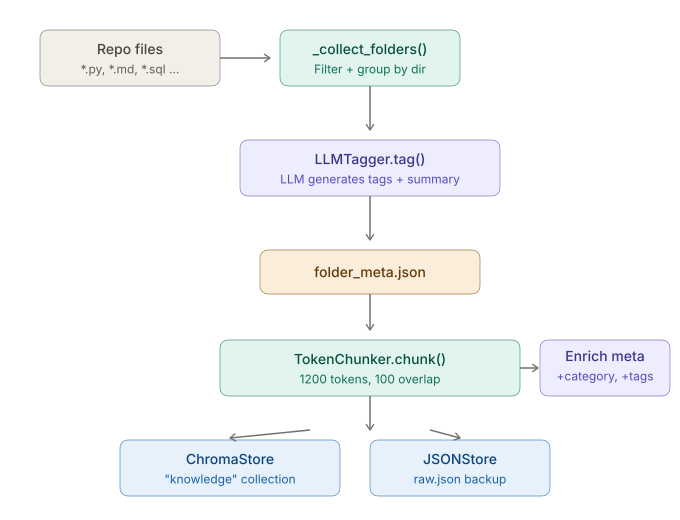

# `main` branch — 架構說明

這個 repo 是 **agent** 專案，放 `agent/` package：LangGraph agent、tool adapters、skills、chat / eval CLI。`rag`（建索引、儲存、檢索、public retrieval API）是獨立 repo，在 `../rag`（github.com:Minervamuses/rag），透過 Poetry path dep 引入。

系統分成兩條獨立 pipeline：**Ingest**（rag 負責建索引）和 **Chat**（agent 驅動對話），唯一的交會點是磁碟上的 store。

---

## Pipeline 1：Ingest（建索引）



這條 pipeline 只跑一次（或資料更新時重跑），把 repo 裡的檔案變成可搜尋的 chunks。流程四步：

1. `_collect_folders()` 掃描 repo，按 `TEXT_EXTENSIONS` 過濾、按 `SKIP_DIRS`（含 `plan_logs`）排除，把檔案按**所在目錄**分組。對 `.md` 檔額外檢查 `do_not_index: true` frontmatter sentinel；命中就 skip — 雙保險防止 plan-mode 對話紀錄回流到 KB。

2. `LLMTagger.tag()` 對每個目錄呼叫一次 LLM，輸入是目錄路徑 + 檔名 + 檔案預覽，輸出是 2–4 個 tags 和一段 summary，存進 `folder_meta.json`。

3. `TokenChunker` 把每個檔案切成 1200 token 的 chunk。切完之後，每個 chunk 的 metadata 會從 `folder_meta.json` 繼承 `category`（第一個 tag）和 `tags`。

4. 所有 chunk 寫入 ChromaDB collection，同時備份到 `raw.json`。

磁碟上三個檔案：`chroma.sqlite3`（向量索引）、`raw.json`（全文備份）、`folder_meta.json`（目錄摘要）。

`ingest_single(path)` 走獨立路徑（單檔 upsert），同樣套用 SKIP_DIRS lineage 檢查與 sentinel 檢查 — 任何位置的 `do_not_index` md 都會被拒。

---

## Pipeline 2：Chat（Agent 查詢）



`agent/graph.py` 只有兩個 node 跟一條 conditional edge，LangGraph 自動處理循環：

**Agent node**：把目前所有 messages（system prompt + 對話歷史 + tool 結果）丟給 LLM，回傳「純文字」或「tool call 請求」。

**tools_condition**：LangGraph 內建 router。有 tool calls → 走 ToolNode；沒有 → 結束，回傳文字。

**ToolNode**：收到 tool call，dispatch 到對應的 tool，結果塞回 messages，自動回到 Agent node，形成循環。tool 拋例外時會被包成一行 `Tool error: ...` 丟回 agent，**不會炸掉整輪對話**。

### 六個工具家族

Agent 啟動時會把下列所有 tool 綁到 LLM；LLM 依照 system prompt 裡的「tool selection policy」自行決定該用哪一個。

**① 本地知識庫（永遠可用）**

由 `rag.TOOL_SCHEMAS` + `rag.dispatch(...)` 生成 LangChain tools；chat graph 不再維護一份獨立的 RAG tool schema。一般 chat 預設只綁互動檢索需要的三個 tool，`rag_list_chunks` 保留給 eval / audit 類內部流程，避免模型誤把整個 `raw.json` 掃進 prompt。

| Tool | 讀什麼 | 用途 |
|------|--------|------|
| `rag_explore` | `folder_meta.json` | 列出 categories、tags、date 範圍、每個目錄的 summary。agent 用來了解「知識庫裡有什麼」 |
| `rag_search` | ChromaDB 向量索引 | 語義搜尋，支援 `folder_prefix` / `category` / `file_type` / `date_from` / `date_to` filter。每筆結果帶 `pid` 和 `chunk_id` |
| `rag_get_context` | `raw.json` | 用 `pid` 找到同一檔案的所有 chunks，回傳目標 chunk 前後 N 個 |
| `rag_list_chunks` | `raw.json` | 不做 embedding，直接列舉 chunks；預設不綁進 chat，只給 eval / audit 使用 |

**② 對話歷史（永遠可用）**

| Tool | 讀什麼 | 用途 |
|------|--------|------|
| `recall_history` | `<rag persist_dir>/chat_history/` ChromaDB | 語義搜尋已成功持久化、且不在目前 prompt 裡的舊對話內容；可選 `role` filter（`user` / `assistant`） |

詳細生命週期見「長期記憶」段。**不是 rag_search 的替代品** — 知識庫文件問題仍走 rag_search。

**③ 本地檔案（永遠可用）**

| Tool | 用途 |
|------|------|
| `read_file` | 讀單一 UTF-8 文字檔（絕對路徑或 cwd-relative）。1 MB 上限。返回 `{path, size, content}` JSON |

讀本地草稿、SKILL.md、reviewer comments、plan log 等。**只能讀檔，不能列目錄** — 列目錄需要 `bash`。

**④ Shell（永遠可用，但每次呼叫都要批准）**

| Tool | 用途 |
|------|------|
| `bash` | 執行 shell command。**每次呼叫**都會跳 prompt 讓使用者按 y/n 批准 |

設計如下：
- 工具入參含必填 `description`（一句話說明意圖），使用者讀這個來決定批准與否
- 預設 deny：空輸入或 y/yes 以外都視為拒絕
- **非 TTY 環境（eval / pytest / pipe）自動拒絕** — 不會 hang 也不會意外執行
- `subprocess.run(shell=True, stdin=DEVNULL, cwd=app_root)`；timeout 預設 30s 上限 300s；輸出超過 256 KB 截斷
- 拒絕時 LLM 收到 `{"approved": false, "error": "..."}`，依 system prompt 不該固執重試

用途：列目錄/找檔（`ls`、`find`）、跑 git/npm 等 utility、使用者明確要求的 one-off pipeline。**不要替代 read_file / rag_search**。

**⑤ Web Search MCP（由環境變數開關；目前啟用）**

透過 `mrkrsl/web-search-mcp` 子進程，背後跑 Playwright 開 Chromium/Firefox 做搜尋。三個 tool：

| Tool | 用途 |
|------|------|
| `full-web-search` | 搜尋 + 抓每個 hit 的全文，吃 token 最多 |
| `get-web-search-summaries` | 只回傳搜尋 snippets，不抓全文，便宜很多 |
| `get-single-web-page-content` | 把一個 URL 的內文抽出來 |

**⑥ GitHub MCP（由環境變數開關；預設關閉）**

透過 `github/github-mcp-server` 子進程，用 PAT 讀遠端 GitHub 狀態。啟用時 agent 會多出 repos / pull_requests / issues / actions / context 等工具。**不是 git 本地操作的替代品** — clone / pull / commit 還是在終端做。

### Tool selection policy（寫在 system prompt）

- 問題是關於這個專案本身或研究筆記 → 用本地 KB（rag_explore / rag_search / rag_get_context）
- 問題提到之前 chat 講過的事，但已不在 prompt 裡 → 用 `recall_history`
- 問題是關於本地檔案或 skill 內容 → 用 `read_file`
- 需要列目錄、找檔、跑 utility 等 shell 操作 → 用 `bash`（必填一句話 description）
- 問題需要當下的外部資訊 → 用 Web Search MCP
- 問題是遠端 GitHub 狀態（PR、issue、CI） → 用 GitHub MCP
- 某個家族沒綁上來（環境變數關掉）→ 當它不存在，用手上有的

### 工具註冊兩層機制

1. **功能綁定** — `agent/graph.py` build 一個 list 同時餵給 `model.bind_tools(tools)`（送 schema 給 LLM）和 `ToolNode(tools, ...)`（接 tool_call 並 dispatch）
2. **語意提示** — `agent/session.py:SYSTEM_PROMPT` 列出每個工具家族的描述、選用時機、注意事項

兩層缺一不可：第一層讓 LLM 知道工具存在 (schema)，第二層讓 LLM 知道何時該選哪個。

加新工具的最小步驟：寫 `agent/tools/<name>.py` 提供 factory → `agent/tools/__init__.py` re-export → `agent/graph.py` import + append 到 tools list → `agent/session.py` SYSTEM_PROMPT 加一段 → 寫 `tests/test_<name>_tool.py` → 更新 `tests/test_mcp.py` 預期 bound 列表。

### 長期記憶（vector-DB chat history）

對話歷史不是無限塞進 prompt，但也不再走 LLM 壓縮。`agent/memory.py` 是兩層結構：

1. **固定 system prompt**
2. **recent turns**（最近 `config.agent_recent_turns_window` 輪，預設 10）

`TurnRecord` 帶 `persist_target` 欄位（`"chroma"` / `"plan_log"` / `"none"`），決定該 turn 落地到哪：
- 正常模式：`chroma`，eviction 時走 `ChatHistoryStore.add_turn()` 寫入 `<rag persist_dir>/chat_history/`
- Plan 模式：`plan_log`，per-turn 即時 append 到 `plan_logs/plan-{session_id}-{ts}.md`，eviction 時 noop

每完成一輪後 `_evict_overflow()` 檢查 `recent_turns`：超過 window 就把最舊那輪交給 `_store_turn()` 走 dispatcher 分派。寫入後才從 `recent_turns` 移除；CLI 收到 `q` / EOF / Ctrl-C 結束時呼叫 `flush_recent_turns()` 把剩下完成的 turn 處理完。

**沒有 LLM 壓縮成本**：embedding 用本地 Ollama bge-m3，沒有 OpenRouter 呼叫。**內容不失真**：原文逐字保留，需要時透過 `recall_history` 或讀 plan log 取回。**跨 session 累積**：同一個 persist dir 永遠只有一個 chat_history collection。

**失敗處理（明示）**：
- chroma `add_turn` 拋例外 → `logger.warning`，turn 留在 `recent_turns` 下輪再試
- 連續失敗導致 `recent_turns` 超過 `window * 3` → `logger.error`，丟棄最舊那輪防止無限膨脹
- plan log md 寫入失敗 → 整個 turn 視為失敗，**不入 recent_turns 也不遞增 turn_counter**，例外向 CLI 拋出（避免半筆紀錄）

### Plan mode（`/mode plan`）

研究討論用的特殊模式，跟正常模式並存：

| 維度 | 正常模式 | Plan 模式 |
|---|---|---|
| 對話落地 | ChromaDB `chat_history` | `plan_logs/plan-{session_id}-{ts}.md` |
| 工具結果 | 只進 prompt context | **完整渲染進 md**（args + ToolMessage content；單個結果超過 64 KB 截斷只影響 md，不影響 LLM context） |
| 跨 session 索引 | 可被 `recall_history` 搜到 | **永不入 chroma**（gitignored + rag SKIP_DIRS + frontmatter sentinel 三層防護） |
| 切換時機 | `/mode normal` | `/mode plan` |

切 mode 時**不清空 `recent_turns`** — 切換前的 turn 保有原本 persist_target，切換後新 turn 用新 target，eviction 各自走各自的目的地。

**Mode hint 注入**：當 `recent_turns` 含 `persist_target="plan_log"` 的 turn 時，`_prompt_history()` 會在 system prompt 之後動態插入一條 ephemeral `SystemMessage`，提醒 LLM「最近某些 turn 在 plan_logs/、不在 chroma，不要呼叫 recall_history 找它們」。Hint 不持久化，turn 之間動態加減。

`/mode` 是個 framework：`agent/cli/slash_commands.py:_MODE_REGISTRY` 是 `{name → ModeSpec(enter, exit)}` 的 dict，未來加新 mode 只要加 entry。`/mode` 無參數 → 互動選單；`/mode <name>` → one-shot 切換。

### Skills

`agent/skills.py` 啟動時掃描 `skills/*/SKILL.md`，**只讀 YAML frontmatter** 的 `name` 與 `description`，組成一段附加在 SYSTEM_PROMPT 後面的 listing。**完整 SKILL.md 內文不進 prompt** — LLM 判斷某個 skill 適用時，自己用 `read_file` lazy load 該 SKILL.md。Banner 會印 `✓ skill X metadata loaded from skills/X/SKILL.md` 表示載入。

### Session lifecycle（async）

MCP tools 是純 async 的 `StructuredTool`，所以 `ChatSession` 整條路徑也是 async：

- `ChatSession.create(config, load_mcp=True)` — async factory，啟動 MCP subprocess（透過 `load_mcp_tools_with_families()` 同時拿到 tool list 與 `tool_name → family` map，後者用來標記 web_search 工具集）
- `await session.turn(user_input)` — 用 `graph.astream(stream_mode="updates")` 跑一輪，邊跑邊把「哪個 node 產出什麼訊息」餵給 `progress_cb`
- `await session.flush_recent_turns()` — CLI 結束前呼叫

chat CLI 的 `progress_cb` 把每一次 tool call 印成 `→ calling <tool>` / `✓ <tool> returned`。

### MCP subprocess 的兩個 quirk

mrkrsl/web-search-mcp 有兩個壞習慣，在 `agent/mcp.py` 處理掉：

1. **stderr 灌 debug log** — 每個 MCP server 都在 `/bin/sh` 裡啟動，stderr 導到 `~/.cache/agent-mcp/<server>.stderr.log`
2. **stdout 摻非 JSON 行**（`"Shutting down gracefully..."` 之類）會讓 stdio client 炸 `BrokenResourceError`。同一層 shell pipeline 掛了 `grep '^{'`，只讓 JSON-RPC 訊息通過

---

## Slash commands

| 命令 | 用途 |
|---|---|
| `/help` | 列出所有 slash commands |
| `/status` | 顯示 session_id、turn count、recursion limit、last tool counts、`plan_mode`、`plan_log_path` |
| `/mode [name]` | 切換 session mode（無參數 = 互動選單；`/mode plan` = one-shot；可選：`normal`、`plan`） |
| `/init` | Ingest 父 repo（自動排除本 app 專案目錄） |
| `/ingest <path>` | Upsert 單檔或整個目錄到 rag store |
| `/sync [path]` | 顯示「磁碟有但 store 沒有」/ 「store 有但磁碟沒有」（dry run） |
| `/prune [path] [--yes]` | 移除 store 裡 source 已不存在的 entry（`--yes` 才實際執行） |
| `/clear` | 清螢幕 |
| `/quit` (alias `/exit`) | 離開 |

`/ingest` `/sync` `/prune` 在 rag 端拋 `ValueError`（例如 plan_logs 路徑被 SKIP_DIRS / sentinel 擋）時，會被翻譯成 `SlashCommandError` 顯示給使用者，**不炸掉 chat loop**。

---

## 執行長相（chat CLI）

```
$ python -m agent.cli.chat
Agent Chat (LangGraph mode). Type 'q' to quit.
Mode: default

  ✓ skill academic-paper-writing metadata loaded from skills/academic-paper-writing/SKILL.md
>> /mode plan
mode -> plan -> /home/.../plan_logs/plan-XXX-20260510T143017Z.md

>> 列一下 plan_logs 裡有什麼
  → calling bash
────────────────────────────────────────────────────────────
[bash] Agent wants to run a shell command.

  Why: list plan_logs to find recent discussion files
  Cmd: ls -la plan_logs/

Approve? [y/N] y
────────────────────────────────────────────────────────────
  ✓ bash returned
  → calling read_file
  ✓ read_file returned

<agent 的答案>
```

啟動參數：
- `--no-mcp` — 不載入任何 MCP server，只綁本地 agent tool（rag 三個 + recall_history + read_file + bash）
- `--max-turns N` — 一輪對話內最多幾次 tool round-trip（預設 32）

---

## 配置（`agent/config.py:AgentConfig`）

繼承 `rag.RAGConfig`，新增：

| 欄位 | 預設 | 說明 |
|---|---|---|
| `llm_model` | `"z-ai/glm-5"` | Chat 主模型 |
| `gen_llm_model` | `"google/gemini-3.1-pro-preview"` | Eval generator |
| `judge_llm_model` | `"openai/gpt-5.2"` | Eval judge |
| `filter_llm_model` | `"llama3.1:8b"` | Eval filter |
| `agent_max_messages` | 20 | 同輪 prompt message 上限 |
| `agent_max_tool_interactions` | 4 | 同輪 tool round-trip 上限（與 `--max-turns` 不同層） |
| `agent_recent_turns_window` | 10 | prompt-visible 對話 window |
| `plan_logs_dir` | `"plan_logs"` | Plan 模式 md 落地目錄（相對 app root） |
| `plan_log_max_tool_chars` | 65536 | 單個 ToolMessage 寫入 md 的軟 cap（不影響 LLM context） |
| `skills_dir` | `None` | Skill 目錄；None → `<repo>/skills` |
